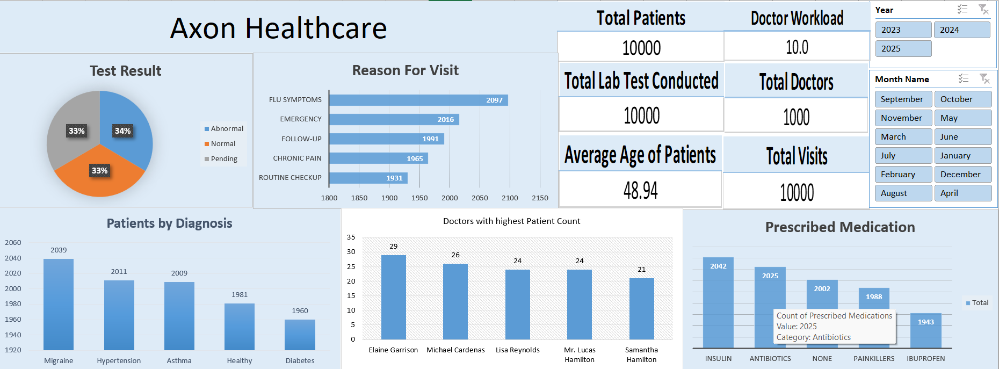

# Axon Healthcare Analytics Project

## Project Overview

End-to-end healthcare analytics project built using Excel, SQL, Power BI, and Tableau to analyze hospital performance, patient trends, treatment outcomes, and operational efficiency.

## Tools & Technologies

- Microsoft Excel
- SQL
- Power BI
- Tableau

## Project Workflow

1. Data Cleaning & Preparation
2. SQL Analysis
3. Excel Dashboard Development
4. Power BI Dashboard Development
5. Tableau Dashboard Development
6. Business Insights Generation

## Key KPIs

- Total Patients
- Treatment Cost
- Average Length of Stay
- Readmission Rate
- Department Performance
- Patient Satisfaction

## Dashboard Preview

## Business Insights

- Identified high-performing departments
- Analyzed patient admission trends
- Evaluated treatment costs
- Monitored operational efficiency

## Author

Mathew Thomson M
